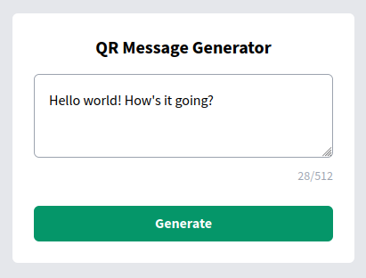
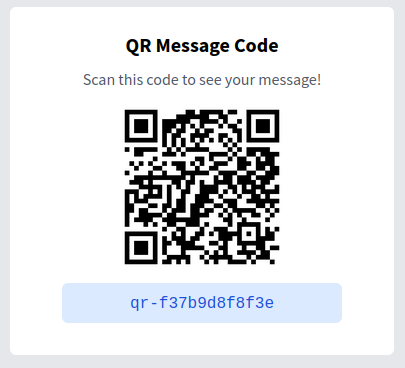
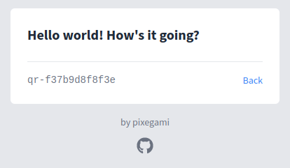

# QR Message Generator

This is a micro web-app that saves a message you entered, and generates a QR code so that anyone can view it later.

[Try out the demo!](https://qr.pixegami.com)

## Usage

Type in a message and hit **Generate**.

The app will save that message into a database, and generate a QR code that you can use to view it again.

Scanning in the QR code (or just entering the tag into the URL) will let you view the saved message.

## Why I made this

I feel like usage of QR codes have been increasing since the start of the pandemic (at least here in Australia). I've seen it used for contact trace check-ins and for restaurants that want to offer a digital menu at their tables.

So I thought it would be fun to learn more about this technology by making a micro-app that stores arbitrary data (in this case the message) and can generate a QR code to access it.

I can refer back to this later if I ever need QR code generation as part of a larger product or service.

## Technical Details

- **Frontend**: React
- **Backend**: Python Lambda function (using [`qrcode`](https://pypi.org/project/qrcode/) library). Integrated with APIGateway so that it becomes a REST API.
- **Infrastructure**: Hosted on AWS, using fully serverless architecture: Lambda, S3, DynamoDB and API Gateway. Infrastructure is managed with [AWS CDK](https://docs.aws.amazon.com/cdk/latest/guide/home.html).
