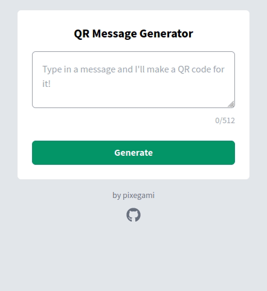

# QR Message Generator

This is a micro web-app that saves a message you entered, and generates a QR code so that anyone can view it later.

[Try out the demo!](https://qr.pixegami.com)



## Usage

1. Type in a message and hit **Generate**.
2. The app will save that message into a database, and generate a QR code that you can use to view it again.
3. Scanning in the QR code (or just entering the tag into the URL) will let you view the saved message.

## Why I made this

I feel like usage of QR codes have been increasing since the start of the pandemic (at least here in Australia). I've seen it used for contact trace check-ins and for restaurants that want to offer a digital menu at their tables.

So I thought it would be fun to learn more about this technology by making a micro-app that stores arbitrary data (in this case the message) and can generate a QR code to access it.

I can refer back to this later if I ever need QR code generation as part of a larger product or service.

## Architecture

- **Frontend**: React
- **Backend**: Python Lambda function (using [`qrcode`](https://pypi.org/project/qrcode/) library). Integrated with APIGateway so that it becomes a REST API.
- **Infrastructure**: Hosted on AWS, using fully serverless architecture: Lambda, S3, DynamoDB and API Gateway. Infrastructure is managed with [AWS CDK](https://docs.aws.amazon.com/cdk/latest/guide/home.html).

## Logic

Most of the app's 'meaty' logic lives in the `qr-code-infrastructure/compute/api` folder, as a bunch
of Python functions.

When a user sends a message, it generates a random tag using `uuid4` (which I truncated to 12
characters to keep it a bit shorter). A URL to view this message is then used to create a QR code.

```python
qr_id = uuid.uuid4().hex[:12]
qr_tag = f"qr-{qr_id}"
content = f"https://qr.pixegami.com/view?tag={qr_tag}"
```

Using the `qrcode` library, I create an image file. This must be saved into `/tmp` folder on Lambda
since that is the only folder that is writable (hence why we need to pass down a `path`).

```python
qr_image = qrcode.make(content)
image_path = os.path.join(path, f"{qr_tag}.png")
qr_image.save(image_path)
```

The image is then uploaded to an S3 bucket.

```python
bucket_name = os.environ["IMAGE_BUCKET_NAME"]
key = f"{qr_result.tag}.png"
s3client = boto3.client("s3")
s3client.upload_file(qr_result.image_path, bucket_name, key)
```

I then create a pre-signed URL from the bucket so that I can tell the frontend where to load the
QR code image from. It expires in `3600` seconds, but that's fine because I don't need the image
itself to be long lived.

```python
presigned_url = s3client.generate_presigned_url(
    "get_object",
    Params={"Bucket": bucket_name, "Key": key},
    ExpiresIn=3600,
)
```

Finally I need to write an entry into the DynamoDB table (I've wrapped it with some micro-ORM) so
that when a user scans a QR code, we can fetch the message later.

```python
item = QrItem()
item.pk = qr_result.tag  # This is the UUID we generated above.
item.message = message  # This is the message body.
self.database.put_item(item)
```

And finally, on the `GET` path (when someone scans the QR code), I just look-up the message using
the provided tag.

```python
serialized_item = self.database.get_item(QrItem(tag))
item = QrItem().deserialize(serialized_item)
message = item.message
```
